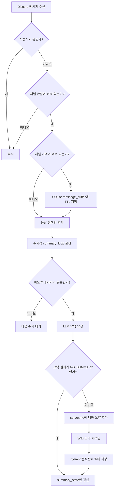
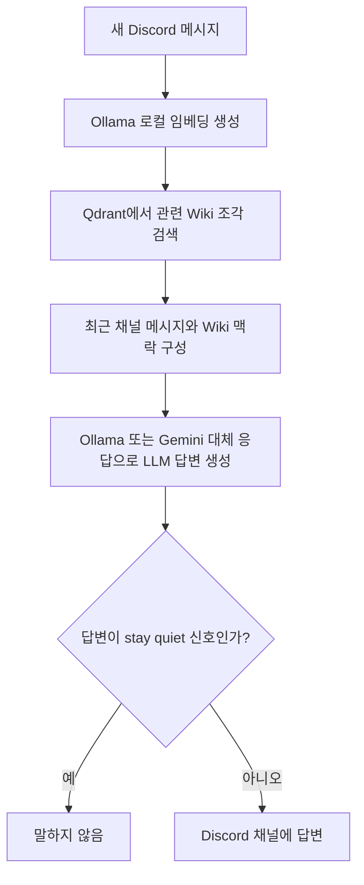

# LLM Wiki 작성 구조

이 문서는 Hixbot이 서버 Wiki를 작성할 때 유지하는 파일 구조, 저장 대상,
요약 흐름, 검색 흐름을 현재 구현 기준으로 정리합니다.

## 전체 저장 구조

```text
DATA_DIR/
├── hixbot.sqlite3
└── wiki/
    └── <guild_id>/
        └── server.md

Qdrant Docker 볼륨
└── 컬렉션: hixbot_wiki_<guild_id>
```

- `DATA_DIR`는 기본값이 `./data`인 로컬 데이터 디렉터리입니다.
- `hixbot.sqlite3`는 원문 영구 보관소가 아니라 설정, 임시 메시지 버퍼,
  요약 기준점, 음소거, 감사 로그, 전역 성격 프로필을 저장합니다.
- `wiki/<guild_id>/server.md`는 서버별 LLM Wiki 본문입니다.
- Qdrant 컬렉션은 `server.md`의 Wiki 조각을 임베딩한 벡터 검색
  인덱스입니다.

## Wiki 파일 형식

`server.md`는 서버마다 하나씩 유지됩니다.

```markdown
# 서버 Wiki

## 2026-06-03T12:34:56+00:00 대화 요약

- 업데이트 시각: 2026-06-03T12:34:56+00:00
- 채널: 1234567890, 2345678901

요약 본문...
```

- 최상위 제목은 `# 서버 Wiki`입니다.
- 각 요약 항목은 `## <UTC 시각> 대화 요약` 제목으로 추가됩니다.
- 항목 메타데이터에는 업데이트 시각과 반영된 Discord 채널 ID 목록이 남습니다.
- 본문에는 LLM이 작성한 한국어 요약만 들어갑니다.

## 저장 대상과 제외 대상

저장 대상:

- 서버에서 반복되는 게임 취향, 파티 모집 습관, 자주 하는 게임.
- 서버 구성원들이 공유한 지속성 있는 일정, 규칙, 선호, 맥락.
- 자주 등장하는 농담, 별명, 밈처럼 다음 대화에 도움이 되는 서버 분위기.
- 게임방+잡담방 운영에 유용한 합의나 기억할 만한 사건.

제외 대상:

- Discord 원문 메시지 전문의 장기 보관.
- 민감한 개인정보, 사적인 신상, 계정 정보, 연락처, 위치 정보.
- 한 번 지나간 잡음, 짧은 감탄사, 맥락 없는 단발성 대화.
- 봇이 작성한 메시지와 관찰이 꺼진 채널의 메시지.
- LLM이 `NO_SUMMARY`로 판단한 지속성 없는 대화 묶음.

## 작성 흐름



핵심 원칙:

- 최근 메시지는 SQLite에 TTL로만 유지합니다.
- 영구 지식은 Markdown Wiki 요약으로만 남깁니다.
- Wiki가 바뀌면 해당 서버 Wiki를 다시 조각으로 나누고 Qdrant에 색인합니다.

## 과거 대화 학습 흐름

```mermaid
flowchart TD
    A[/hix learn start] --> B[learn_jobs 상태를 running으로 전환]
    B --> C[채널별 learn_channel_progress 조회]
    C --> D{last_processed_message_id가 있는가?}
    D -- 예 --> E[저장된 cursor 이후 메시지만 조회]
    D -- 아니오 --> F[해당 채널의 읽을 수 있는 과거 메시지 조회]
    E --> G[50개 단위 batch 처리]
    F --> G
    G --> H[learn_message_buffer에 TTL 저장]
    H --> I[LLM 과거 대화 학습 요약]
    I --> J{NO_SUMMARY인가?}
    J -- 예 --> K[cursor만 갱신]
    J -- 아니오 --> L[server.md에 과거 대화 학습 요약 추가]
    L --> M[새 Wiki 조각을 Qdrant에 색인]
    M --> K
    K --> N{stop 요청이 있는가?}
    N -- 예 --> O[진행 위치 유지 후 idle]
    N -- 아니오 --> P[다음 batch 또는 다음 채널]
```

- `start`는 항상 이어서 시작합니다. 이미 처리한 cursor 이전 메시지는 다시 요약하지 않습니다.
- `stop`은 현재 batch를 마친 뒤 멈추며, `learn_channel_progress`는 삭제하지 않습니다.
- 처음부터 다시 학습하는 reset 기능은 현재 범위에 없습니다.
- 같은 batch는 Wiki 요약과 별도로 전역 Hixbot 성격 프로필 업데이트에도 사용됩니다.

## 검색과 답변 흐름



- 검색 대상은 `server.md`에서 추출된 Wiki 조각입니다.
- 검색 결과는 LLM 프롬프트의 Wiki 맥락으로 들어갑니다.
- SQLite의 전역 성격 프로필이 있으면 모든 서버 답변의 Hixbot 말투 가이드로 함께 들어갑니다.
- Qdrant 또는 임베딩이 실패하면 Wiki 검색 없이 최근 대화만으로 답변을 시도합니다.

## SQLite와 Qdrant 역할 구분

| 저장소 | 역할 | 영구 원문 보관 여부 |
| --- | --- | --- |
| SQLite `message_buffer` | 최근 대화 TTL 버퍼와 요약 입력 | 아니오 |
| SQLite `summary_state` | 어디까지 요약했는지 기록 | 해당 없음 |
| SQLite `channel_config` | 채널별 관찰, 응답, 기억, 대기 시간 설정 | 해당 없음 |
| SQLite `mutes` | 서버/채널 단위 임시 음소거 | 해당 없음 |
| SQLite `audit_log` | 운영 명령 실행 기록 | 해당 없음 |
| SQLite `learn_jobs` | 과거 대화 학습 작업 상태 | 해당 없음 |
| SQLite `learn_channel_progress` | 채널별 마지막 학습 cursor | 해당 없음 |
| SQLite `learn_message_buffer` | 과거 대화 학습용 TTL 원문 버퍼 | 아니오 |
| SQLite `persona_profile` | 모든 서버가 공유하는 Hixbot 전역 성격 프로필 요약 | 요약만 |
| Markdown `server.md` | 서버 장기 기억의 사람이 읽는 원본 | 요약만 |
| Qdrant 컬렉션 | Wiki 요약 조각의 벡터 검색 인덱스 | 요약만 |

## 운영 명령과 Wiki 관계

- `/hix wiki search query`: Qdrant에서 Wiki 조각을 검색해 결과를 보여줍니다.
- `/hix wiki export`: 현재 서버의 `server.md`를 Discord로 내보냅니다.
- `/hix wiki delete target`: 제목 일부 또는 조각 ID와 일치하는 Wiki 항목을 삭제하고 재색인합니다.
- `/hix config remember:false`: 해당 채널 메시지를 Wiki 요약 후보에 넣지 않습니다.
- `/hix mute`: 봇 응답을 잠시 멈추지만, 채널 설정에 따라 관찰/기억 정책은 별도로 판단됩니다.
- `/hix learn start`: 저장된 cursor 이후부터 과거 대화 학습을 이어서 시작합니다.
- `/hix learn status`: 과거 대화 학습 상태와 마지막 cursor를 확인합니다.
- `/hix learn stop`: 진행 위치를 유지한 채 현재 batch 이후 과거 대화 학습을 멈춥니다.
- `/hix persona status`: 봇 소유자가 전역 Hixbot 성격 프로필을 확인합니다.
- `/hix persona reset`: 봇 소유자가 전역 Hixbot 성격 프로필을 초기화합니다.
